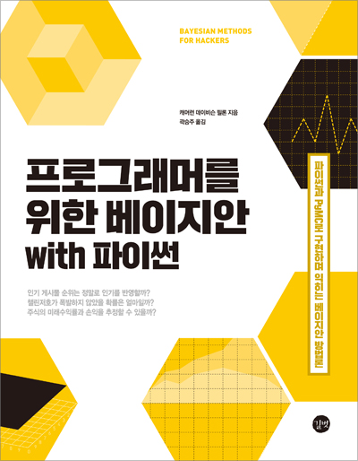

# Bayesian-with-Python
## 1. 교재 

### 한글 : 프로그래머를 위한 베이지안 with 파이썬

### 원서 : [Probabilistic Programming & Bayesian Methods for Hackers](https://www.amazon.com/Bayesian-Methods-Hackers-Probabilistic-Addison-Wesley/dp/0133902838)

## 2. 목적

베이지안 확률에 대한 기초적인 공부에서 시작해서 깊이 있는 공부를 위해서

## 3. 목차 

- [1장 - 베이지안 추론의 철학](https://github.com/ExcelsiorCJH/Bayesian-with-Python/blob/master/Chap01-Introduction/Chap01-Introduction.ipynb)
- [2장 - PyMC 더 알아보기](https://github.com/ExcelsiorCJH/Bayesian-with-Python/blob/master/Chap02-MorePyMC/Chap02-MorePyMC.ipynb)
- [3장 - MCMC 블랙박스 열기](https://github.com/ExcelsiorCJH/Bayesian-with-Python/blob/master/Chap03-MCMC/Chap03-Intro_MCMC.ipynb)

## 4. 참고 자료

- GitHub(ENG) : https://github.com/CamDavidsonPilon/Probabilistic-Programming-and-Bayesian-Methods-for-Hackers
- GitHub(KOR) : https://github.com/DoosanJung/Bayesian-for-Hackers-Korean
- 길벗-GitHub : https://github.com/gilbutITbook/006775

